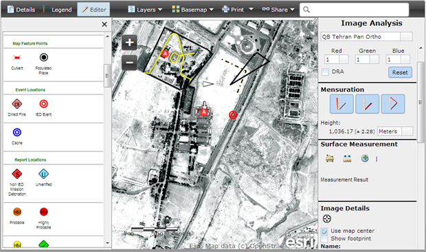

defense-image-observables-viewer
================================

___This repository is no longer maintained. For more information, please visit the [Esri Product Life Cycle](http://support.esri.com/en/content/productlifecycles) page.___

The Image Observables web application supports measurement, mensuration and digitization of features from image services.  Image services can also be adjusted (brightness, contrast, channels).

## Features

* Supports measurement, mensuration and digitization of image services
* Supports adjusting display effects such as brightness, contrast, channels
* Other miscellaneous capabilities such as thumbnail and image details

## Sections

* [Requirements](#requirements)
* [Instructions](#instructions)
* [Resources](#resources)
* [Issues](#issues)
* [Contributing](#contributing)
* [Licensing](#licensing)

## Requirements

* Web server 
* Notepad or HTML editor
* Experience with HTML/CSS/Javascript
* Experience with the [ArcGIS Javascript API](http://links.esri.com/javascript)

## Instructions

### Install the web application

These instructions assume that you have a Web server like [Internet Information Services(IIS)](http://www.iis.net/) installed and setup on your machine. If you are using another Web server the general installation steps will be the same but you will need to check your Web server's documentation for specific information on deploying and testing the application.

1. Copy the contents of the repository or zip file into your web server's root directory. In IIS, the default location for the web server's root folder is `c:\inetpub\wwwroot`
2. In IIS, convert the folder to a "Web Application" and add .json (application/json) MIME type
3. (Optional). If your application edits features in a feature service or generates requests that exceed 2000 characters you may need to setup and use a proxy page. Common situations where you may exceed the URL length are, using complex polygons as input to a task or specifying a spatial reference using well-known text (WKT). View the [Using the proxy page](http://help.arcgis.com/en/webapi/javascript/arcgis/jshelp/#ags_proxy) help topic for details on installing and configuring a proxy page.
4. Test the page using the following URL: http://localhost/[ImageObservablesPath]/index.html, where [ImageObservablesPath] is the name of the folder where you extracted the repository or zip contents.

## Resources

* [ArcGIS for JavaScript API Resource Center](http://help.arcgis.com/en/webapi/javascript/arcgis/index.html)
* [ArcGIS Blog](http://blogs.esri.com/esri/arcgis/)

## Issues

Find a bug or want to request a new feature?  Please let us know by submitting an issue.

## Contributing

Esri welcomes contributions from anyone and everyone. Please see our [guidelines for contributing](https://github.com/esri/contributing).

## Licensing
Copyright 2013 Esri

Licensed under the Apache License, Version 2.0 (the "License");
you may not use this file except in compliance with the License.
You may obtain a copy of the License at

   http://www.apache.org/licenses/LICENSE-2.0

Unless required by applicable law or agreed to in writing, software
distributed under the License is distributed on an "AS IS" BASIS,
WITHOUT WARRANTIES OR CONDITIONS OF ANY KIND, either express or implied.
See the License for the specific language governing permissions and
limitations under the License.

A copy of the license is available in the repository's [license.txt](license.txt) file.

